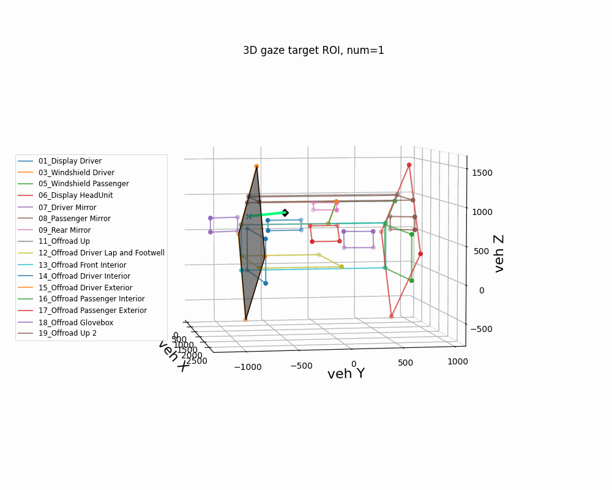

# Convert head position and eye gaze roi on 3D

2021년타사업체의 얼굴 인식 알고리즘의성능을 검증하기 위해,
기존 개발했던 얼굴 인식의 GT데이터와 녹화된 영상으로 관계를 검토 하려한다.
(대외비 관련된 내용은 언급하지 않으려함)

 1. 기존 개발 얼굴인식 GT의 Head position, rotation의 차량,카메라,디스플레이 좌표계 변환 및 검증
 2. 기존 개발 얼굴인식 GT의 Eye gaze를 이용해, Head와 Eye의 최종 vector를 도출
 3. 기존 개발 얼굴인식 GT의 gaze를 이용해, 차량 좌표계상의 3차원 공간들과의 통과 유무 검토(ROI 매칭)
   (앞유리, 사이드 미러, 룸미러, 계기판 등등)
 4. 타사업체의 얼굴 인식 알고리즘의 결과와 기존 개발 얼굴인식의 차이점 검토
 5. 타사업체의 최종 gaze vector를 도출 
 6. ROI 매칭 검토후, accuracy 계산

 

# 3D target ROI 영역
 

# Head and Eye gaze 합성

# 최종결과
Eye and target roi 랜더링&애니메이션 추가

# Gaze ROI 성능 검증 작업 예상일정
 1. 기존 제품 차량좌표계, 디스플레이 좌표계, 카메라 좌표계의 차이 파악 및 변환식 검토(~1 weeks) - 완료
 2. 타사 제품 카메라 좌표계 파악 및 차이점 분석/Eyeclosure 정의 및 iris관련 변환 파악(~1 weeks) - 완료
 3. 변환 코드 구현 (~1 weeks) - 완료
 4. 선분과 평명의 충돌여부 판별 유무 검토(ROI 매칭)(~0.5 weeks) - 완료
 5. 기존 제품 GT데이터를 이용한 Gaze 검증(~1.5 weeks) - 미완료
 6. 타사 제품 데이터를 이용한 Gaze검증(~1 weeks) - **진행중**
 7. Validataion (~1 weeks)

# 실행파일 설명
| FileName | Description | Remark |
| --       | --          | --     |
| cvt_coord_to_mra2_02.py|1.카메라 좌표계 Head pos를 차량 및 디스플레이 좌표계로 변환, Head rot는 동일하다는 가정,  2.Eyeclosure의 iris height pixel추가| --|
| cvt_coord_to_mra2_04.py |1.카메라 좌표계 Head pos,rot를 차량 및 디스플레이 좌표계로 변환, Head rot가 좌표계별로 다르다는 가정(계산수식 추가),  2.Eyeclosure의 iris height pixel추가| --|
| check_gaze.py |기존 제품 GT데이터의 단일 Head pos,rot, Eye gaze, 3D target ROI 계산| --|
| testcode_intersection.py |선과 평면의 교차점 검증 작업(3D target ROI 매칭)| --|
| check_gaze2.py |**(진행중)** 기존 제품 GT데이터와 3D target ROI정보를 연결 인터페이스 작업| --|
| check_gaze3.py |**(예정)** 기존 제품 GT데이터를 이용하여,3D target ROI 매칭 여부 구현| --|
| cvt_coord_to_mra2_05.py |**(예정)** 타사 알고리즘의 결과데이터의 최종 Eye gaze vector 계산 작업| --|
| cvt_coord_to_mra2_06.py |**(예정)** 타사 알고리즘의 결과데이터의 최종 Eye gaze vector와 3D target ROI 매칭 작업| --|
| render_animation.py |From eye gaze to target roi 랜더링&애니메이션 작업| --|
|   |   |   |
 
 
# 참고문헌
https://stackoverflow.com/questions/5666222/3d-line-plane-intersection 선분과 평면의 교차점 판별 방법1  
https://gist.github.com/TimSC/8c25ca941d614bf48ebba6b473747d72 선분과 평면의 교차점 판별 방법2  
https://soooprmx.com/archives/10607 영역안에 점이 존재유무 판별  
http://geomalgorithms.com/a05-_intersect-1.html 선분과 평면의 교차점 공식  
http://www.songho.ca/math/line/line.html 선분과 평면의 교차점 example  
https://gaussian37.github.io/ml-concept-ml-evaluation/ Accuracy, Precision, Recall, F1 Score  

#### and so on
**반드시** 얼굴과 눈의 조합으로 Final Gaze를 합성해야함 
(얼굴을 고정하고, 눈의 차이를 보여주는 영상 모음)
 
 
